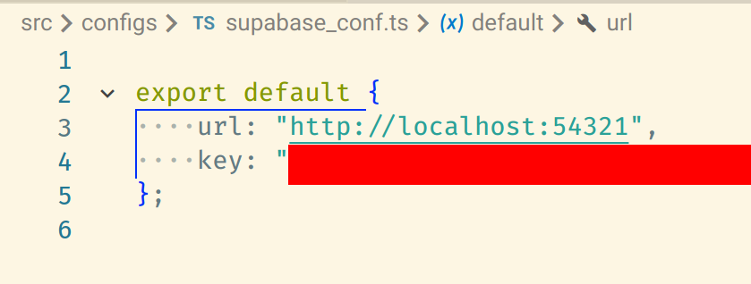

# Development Environment Suggestions

## Configure Application Runtime Options

Before you start, you need to fill in some blanks for the application to help it works in a certain way.

Copy all files under "docs/runtime_options" (the "runtime_options" directory at the same level of this file) to "src/configs".

- "supabase_conf.ts"

You must fill in your "anon key" and "URL" here to help the application communicate with the Supabase instance. Paste your anon key in "key", and your URL in another field.

## Editors / IDEs

Workspace in Magicbroad includes multiple programming languages, file formats and tools. It's recommended to have your editors' or IDEs' support for them:

- TypeScript (including `.tsx`) and JavaScript
- ESLint
- Stylus
- EditorConfig
- Git (`.gitignore`, `.gitattribute`)
- YAML
- Markdown
- JSON
- TOML (Supabase local deployment uses a TOML file for configuration)
- SQL (Supabase database migration)

### Visual Studio Code

VS Code has built-in support for TypeScript and JavaScript.

Recommended extensions:
- [EditorConfig for VS Code](https://marketplace.visualstudio.com/items?itemName=EditorConfig.EditorConfig) for editor config support
- [ESLint](https://marketplace.visualstudio.com/items?itemName=dbaeumer.vscode-eslint) for ESLint integration
- [stylus](https://marketplace.visualstudio.com/items?itemName=sysoev.language-stylus) for stylus support

It's also recommended to install extensions for:
- YAML support
- TOML support
- SQL support
